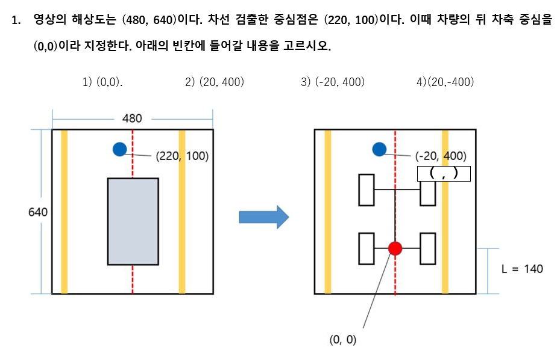
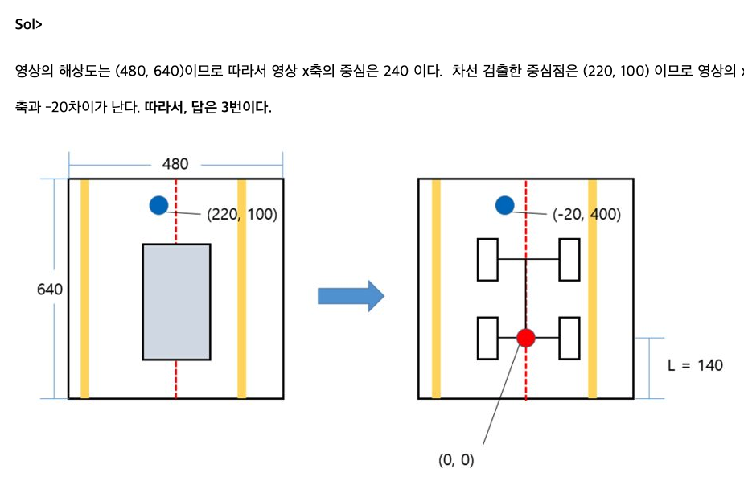
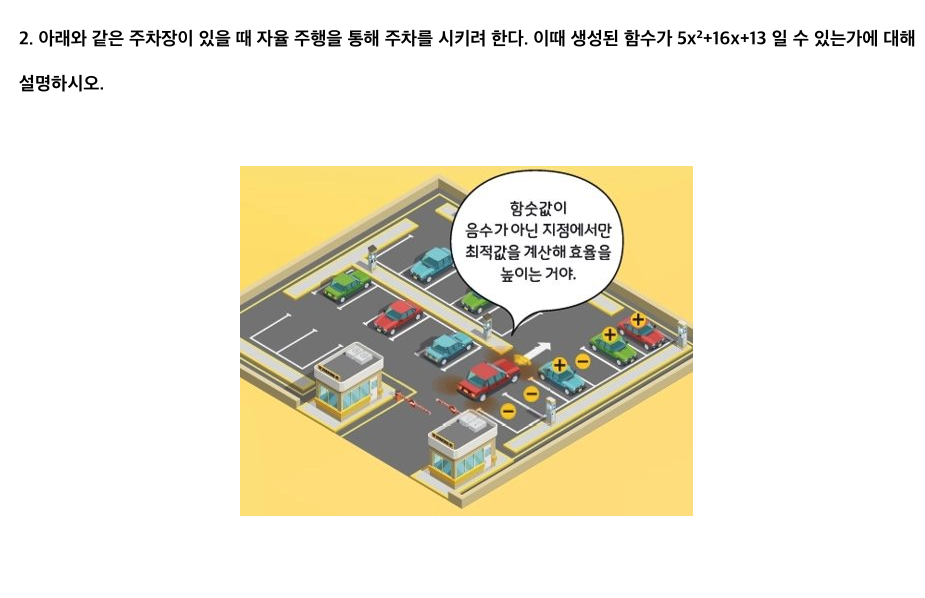
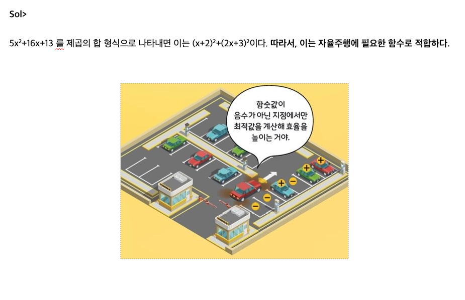
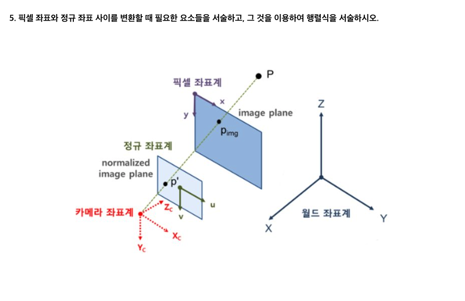
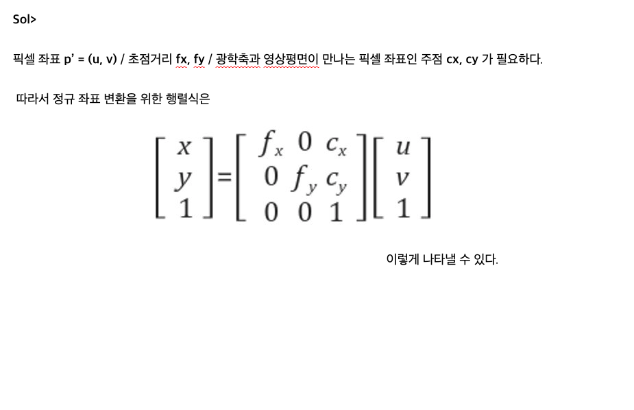
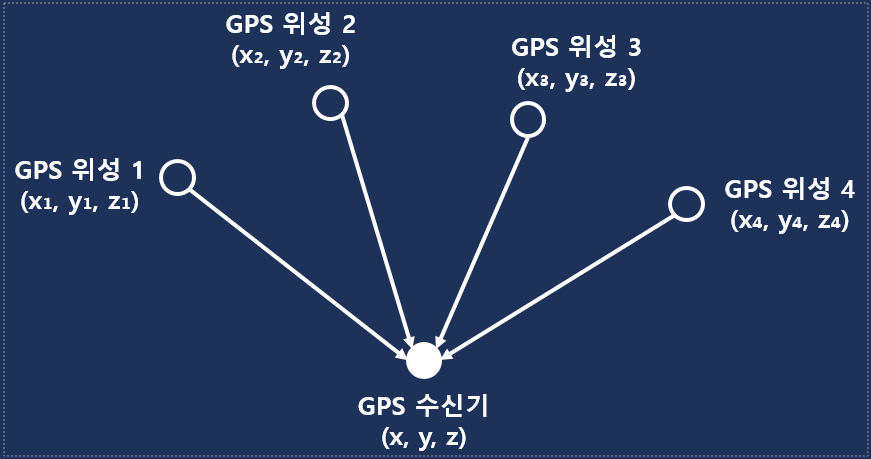
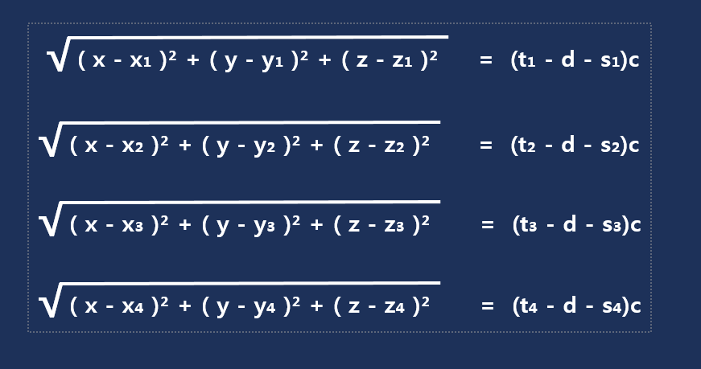
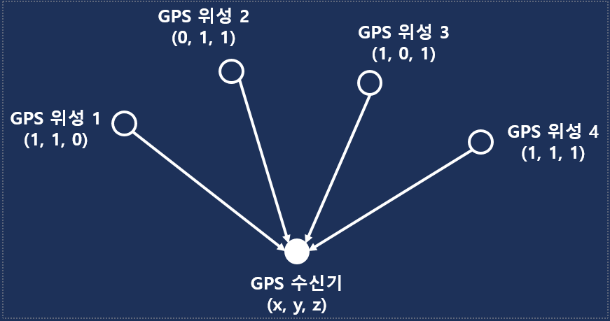
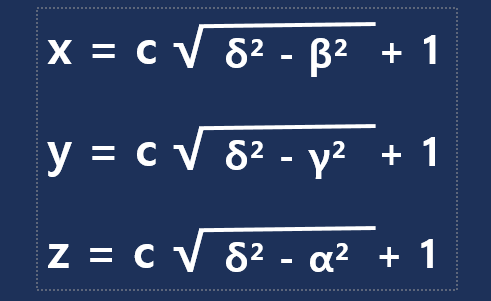

# 응용수학 문제 정리

## [알고리즘] 유니티의 흐름.
### 고대영/김진용

유니티 내부적인 작동 순서를 설명함. 
나올 가능성은 낮아보임.

> 객체의 좌표가 (2, 3, 5)에서 3초 후 (8, 6, 11)로 이동하였다. 이때 벡터의 방향 및 크기를 구하여라.
>> 정답 : v(2, 1, 2), 크기 3

>문제 : 유니티에서 적용되는 흐름도의 순서를 알맞게 나열하시오.
>> 정답 : Initialization-> Physics - > Input - > Game logic -> Rendering -> Destroy

## 자율주행
### 구예지/김희연

월드/카메라/정규/픽셀 좌표계와 그 가운데 변환
힐베르트의 17번 문제
SVM

>
>>

> 아래와 같은 주차장이 있을 때 자율 주행을 통해 주차를 시키려 한다. 이때 생성된 함수가 5x²+16x+13 일 수 있는가에 대해 설명하시오.

>>

> ( 마진 ) 은 클래스들 사이의 간격, 각 클래스의 말단에 위치한 데이터들 사이의 거리를 의미합니다. SVM 은 분류를 할 때 이 ( 마진 ) 을 최대화 시키고자 합니다.

>  ( 서포트 벡터 ) 는 마진에서 가장 가까이 위치해 있는 각 클래스의 데이터 입니다. ( 서포트 벡터 ) 데이터들의 위치에 따라 경계의 위치가 달라집니다.

>SVM 의 정의를 설명하시오.
>>SVM 은 n차원인 공간을 (n-1) 차원으로 나눌 수 있는, 즉 데이터를 분리하는 최적의 초평면, 최대 마진이 되도록 클래스를 분류하는 기법입니다.

> 픽셀 좌표와 정규 좌표 사이를 변환할 때 필요한 요소들을 서술하고, 그 것을 이용하여 행렬식을 서술하시오.

>> 픽셀 좌표 p’ = (u, v) / 초점거리 fx, fy / 광학축과 영상평면이 만나는 픽셀 좌표인 주점 cx, cy 가 필요하다.따라서 정규 좌표 변환을 위한 행렬식은 이렇게 나타낼 수 있다.

## 빅데이터 알고리즘과 하둡의 적용예
### 김동희/임정묵

형태소 분석 후 tf-idf 알고리즘에 넣어 돌림

tf-idf 알고리즘:

단어 빈도수(단어가 문서에 나타난 횟수)*log(역문서빈도수(문서빈도수의 역수)/문서 빈도수(해당 단어가 나타난 문서의 수))

> 다음 표는 문서 1,2,3에 등장하는 특정 단어의 수를 나타낸 것이다.
어떤 문서의 어떤 값이 가장 높은 TF-IDF 값을 갖는가?

| | 사과 | 딸기 | 포도 | 배 | 바나나 | 감 | 수박 | 토마토 | 키위 | 멜론 |
|---|------|------|------|-----|-----|----|-----|-----|-----|-----|
|문서1|1|1|1|1|1|1|0|1|1|1|
|문서2|0|0|0|0|0|1|1|0|0|0|
|문서3|1|1|1|1|0|1|1|1|1|1|

>> TF-IDF -> tf*log(N/df) 
단어 빈도수는 등장하지 않은 단어를 제외하면 모든 단어가 1이다. 
또한 문서의 수 N도 3으로 모두 같으므로 df가 가장 작을수록 TF-IDF 값이 높다.
따라서 df 값이 가장 작은 문서 1의 바나나의 TF-IDF 값이 가장 큰 수를 갖는다.

> 다음 표는 문서 1~10에 등장하는 특정 단어의 수를 나타낸 것이다. (단, log2 = 0.3010, log3 = 0.4771) 문서 3에서 포도의 TF-IDF 값이 0.3010일 때, ?의 값은 무엇인가?

| | 문서1 | 문서2 | 문서3 | 문서4 | 문서5 | 문서6 | 문서7 | 문서8 | 문서9 | 문서10 |
|-----|------|-----|-----|-----|-----|-----|-----|-----|-----|----|
|사과|1|1|1|1|1|1|1|1|1|1|
|딸기|1|1|3|2|1|0|1|1|2|0|
|포도|1|?|1|1|0|0|0|0|1|1|
>> TF-IDF -> tf*log(N/df)
문서 3에서 포도의 TF = 1, N = 10, df = 5 + □
1*log(10/5+□) = 0.3010 = log2
log(10/5+□) = log2 , □ = 0, 따라서 ? = 0

## 블록체인의 설명
### 김재준/한재서

비잔틴 장군의 딜레마와 그의 해결방법을 위해 도입된 작업증명(Proof of work)
블록체인과 그 구현방식

> 비잔틴 장군의 딜레마를 해결하기 위한 블록체인 알고리즘의 특성은?
>> 작업증명 (Proof of work)

> 블록체인은 자료구조의 구현 종류중 어느 부분에 속하는가?
>> 연결리스트(Linked List)

## IOT 활용 사례와 적용 기술
### 김지연/전채은

스마트 칫솔 사례로 IOT 적용 기술을 서술.

솔직히 아마존의 클라우드 서비스 기능중 하나인 AWS IoT를 쓴거라 뭐가 나올것 같지 않음.

RFID에 대한 간략한 설명

## IoT/UseCase
### 김태완/전승원

GPS에 대한 내용.

> 다음과 같이 GPS 수신기와 GPS 위성1, 2, 3, 4의 좌표가 나타나 있다. 각 GPS 위성이 보내는 시점의 시간을 각각 s1, s2, s3, s4라 하고 GPS 수신기에 신호가 도착한 시간을 각각 t1, t2, t3, t4라고 할 때 GPS 수신기를 구하는 식을 유도하라. (단, 시간에 대한 오차는 d라 하며, c는 GPS 위성의 전파 속도인 빛의 속도이다.)

>>

>각각의 GPS 위성에 좌표가 다음과 같고 각 GPS 위성에서 보낸 시간과 GPS 수신기에 도달한 시간의 차가 각각 α, β, γ, δ 라 할 때 Question.1에서 유도한 식을 이용하여 GPS 수신기의 좌표를 구하여라. (단, 시간의 오차 d = 0이며 GPS 위성의 전파 속도는 c라고 한다.)

>>

## 빅데이터와 기술통계
### 김현재/신중수

빅데이터가 무엇인지 서술하고 통계적 이론을 서술
Box plot//

> 빅데이터의 정의
>> 기존 방식으로 처리할 수 없는 다양한 종류의 대규모 데이터로부터 가치를 추출하는 것

> 빅데이터의 특성
>> 1. Volume : 방대한 양의 데이터
>>2. Velocity : 매우 빠른 데이터의 생성속도와 데이터의 실시간 처리
>>3. Variety : 정형, 반정형, 비정형 데이터
>>4. Veracity : 방대한 데이터 속에서 뽑아낸 데이터의 신뢰성
>>5. Value : 데이터의 유의미한 가치 파악

> 데이터의 정형화 정도에 따른 3가지 분류 예시 및 그에대한 설명
>>1. 정형 데이터 : 일정한 형식, 기준을 갖추어 저장할 수 있는 데이터. 예를 들어 데이터베이스, 스프레드시트, CSV 등이 있다.
>>2. 반정형 데이터 : 형태가 있으며 연산이 불가능한 데이터. 예를 들어  XML, HTML, JSON 등이 있다.
>>3. 비정형 데이터 : 형태가 없으며 연산이 불가능한 데이터. 예를 들어 소셜미디어,  영상, 이미지 등이 있다.

> box plot 그리기
>			-10  28  29  29  30  34  35  35  37  60
>>그림 참조

## 자율주행차
### 박상우/이우형

자율주행차의 정의 및 기술 구현 단계 설명

현재의 구현 상황

사용되는 기술(밀리파 레이더/라이다 등)

> Q .  함수의 값이 음이 아닐 경우,, 제곱의 합의 형태로 바꿀 수 있는가? 이 것이 자율주행차가 주차할 때 어떻게 활용될 수 있는가?
>>‘음이 아닌 유리함수를 언제나 제곱의 합의 형태로 나타낼 수 있다.
>>1927년 오스트리아 수학자 에밀 아르틴이 증명

## 빅 데이터를 이용한 교통
### 박예진/오성호
빅 데이터를 기반으로 교통 분야의 의사결정 사례

> 발표 주제 외에 빅데이터가 사용된 사례 2가지만 
예를 들어보시오.
>> 다음 중 빅데이터의 구성요소(3V)에
해당하지 않는 것을 모두 고르시오

## 블록체인 심화 이론
### 박준영/유성준

블록체인 소스코드 가져와서 설명

> 1. 블록체인에서 해쉬함수가 필요할까요(o/x)?
>> O
> 2. 블록체인의 한 종류로 허가된 개인 또는 기관만 참여할 수 있는 블록체인은? 
>> 프라이빗 블록체인
> 3. 블록체인을 통하여 식품을 유통하였을 때 장점은?
>> 상품의 신뢰도 증가

## 인공지능의 역사와 기초
### 안석현/박재성

이 미친 트롤러새끼야
문제까지 냈으면 넌 이미 연못에서 변사체로 발견됐을거다 

퍼셉트론/역전파(편미분)/합성곱신경망(합성곱)/강화학습(사실 나도 잘 모름)

## 최단경로 알고리즘
### 정원영,추영호,최상훈

다익스트라 알고리즘

플로이드 - 워셜 알고리즘

벨만 - 포드 알고리즘

>도시와 도시사이를 운행하는 시외버스가 있다.
도시가 여러 개가 있으며, 모든 도시의 쌍 사이 시외버스의 최단경로 노선을 구하고 싶을때, 어떤 알고리즘이 적절한가?
>>1. 다익스트라
>>2. 플루이드 – 워셜
>>3. 밸만 포드
>>>답: 플루이드 - 워셜

>복잡한 골목길에서 목적지를 찾아가려고 한다. 가장 빠르게 갈 수 있는 경로를 찾고 싶을때, 어떤 알고리즘을 사용하는게 좋을까?
>>1. 다익스트라
>>2. 플루이드-워셜
>>3. 밸만포드
>>>답:벨만포드

## 다층 퍼셉트론
### 김소연/이수연

MLP와 그 예제

역전파/경사하강법
> 인간의 신경세포를 모방하여 만든 퍼셉트론에서 활성화 함수는 어떤 역할을 표현한 것인지 서술하라.
>> 퍼셉트론에서는 임계값 이상의 값일 경우에만 다음 노드로 값을 전달한다.
이는 실제 신경세포에서 신호들의 강도의 합이 역치 이상일때만 축삭돌기로 신호를 전달하는 것을 표현한다.

>다음과 같은 그림에서 계층 2 노드들의 값을 행렬의 내적을 이용해 표현하라.
>그림 추가
>>그림추가

>은닉층의 1번, 2번 노드의 오차를 오차의 역전파를 통해 구하라.
>그림 참고
>>𝑒_1=0.42,
𝑒_2=0.88(그림참고)\

>함수의 최저점을 구하는 방법 중 하나로 기울기가 완만해지는 쪽으로 이동하는 접근 방식을 무엇이라고 하는가?
>>경사하강법

## 자율주행
### 이시은/이지현

자율주행과 그 사례 중심.

> 다음은 스위스의 세계최초 자율주행 버스 이다. Smart Shuttle의 기술 수준은?
>> Smart Shuttle은 완전 자율주행 버스로 운전자와 운전대가 필요 없는 무인 버스이므로
기술 수준 Level 5에 해당한다.

>다음은 자율주행열차의 동적경로 기술이다. 자율주행열차의 알고리즘을 보고 다음 빈칸을 채워라.(그림참고)
>>① 상황인지 및 판단
>>② 주행경로 결정
>>③ 주행 제어	
>>④ 센서의 입력 데이터
>>⑤ 위치 인지
>>>답:1번	

> 다음은 자율주행항공기의 오토 파일럿의 알고리즘을 순서대로 나열한 것이다.
	[?]에 들어갈 말을 쓰고, 해당 단계를 거치는 번호를 모두 고르시오.
>> 1.	항공기는 출발지와 목적지의 좌표를 입력 받음
>>2.	2차원을 대상으로 하는 다른 이동 수단과는 다르게  항공기는 3차원에서의 운항을 대상으로 함 ➡ 반드시 날개의 편향 발생
>>3.	날개의 위치 센서가 이 편향을 감지하고 신호를 오토 파일럿 컴퓨터로 보냄
>>4.	오토 파일럿 컴퓨터는 입력 데이터를 처리하고 날개가 더 이상 수평이 아닌지 확인
>>5.	오토 파일럿 컴퓨터는 항공기의 보조 날개를 제어하는 ​​신호를 제어장치로 보냄 
>>6.	입력 데이터를 기반으로 보조 날개가 조정되면 날개가 다시 수평으로 이동
>>7.	날개의 위치 센서가 날개가 다시 한 번 수평임을 감지하면 오토 파일럿 컴퓨터가 명령(신호)을 제거
>>>답: 3,7번 

## 블록체인과 가상화폐
### 이재휴/박병조

배경/원리및 가상화폐/문제점

> 블록 체인에 대하여 간략히 설명하고, 이를 간단히 그림으로 표현하세요.
>>거래 정보를 가지고 있는 블록이 연결리스트(Linked-List)의 형태로 연결되어 있는 것을 
블록 체인(Block Chain)이라고 함
즉, 블록체인 = 해시 값을 저장한 노드들의 연결 리스트

> 다음 수식이 의미하는 것을 설명하세요(사진참고)
>>작업 증명(Proof of Work ; PoW)
>>- 블록체인의 검증(Verification)을 하기 위한 합의 알고리즘(Consensus Algorithm)
>>- 작업 증명은 특정한 노드가 특정한 난이도의 해시값을 구함으로써 블록에
  내용을 수정 및 삭제를 하거나 체인에 새로운 블록을 형성하는 권한을 부여
>>- 이 때 특정한 난이도의 해시값을 구하는 것을 채굴(Mining)이라 함

## 위상정렬
### 이정섭/박원진
스타크래프트 ai를 예시로 위상정렬 알고리즘을 설명

> 위상 정렬(Topological Sort)과 순위 알고리즘의 차이점?
>> 위상 정렬은 정점을 찍는 순서들을 정렬하는 알고리즘이고, 결과는 1가지 이상이다.
>>순위 알고리즘은 효율적인 순서를 정하는 알고리즘이고, 결과는 1가지이다.

> 위상 정렬은 어떤 형식의 그래프인가?
>> Directed Acyclic Graph 형식 	

## 알고리즘
### 이종원/현승호

정렬 알고리즘 설명, 힙정렬 소개.

>퀵소트는 다른 O(n log n)의 복잡도를 가지는 정렬 알고리즘보다 더 빠르게 수행됩니다. 불필요한 데이터의 이동을 줄이고 먼 거리의 데이터를 교환할 뿐만 아니라 한번 결정된 기준은 추후 연산에서 제외되는 성질을 가지기 때문입니다. 하지만 힙정렬보다 수행시간이 낮은 상황은 언제 일까요?
>>모든 배열이 정렬되어있을 때, 기준값이 최대/최소 값일 때 최악의 시간 복잡도O(n²)가 발생한다.

## 인공지능
### 정민지/김경민

머신러닝의 분류에 대한 소개.

>머신러닝의 종류 4가지는 ?
>> 지도/ 비지도/반지도/강화

>지도학습은 ( 분류 ) 와 ( 회귀분석 )를 활용한 것.

>손실함수에서 오차를 계산 할 때 (t – y)가 아닌 〖(𝑡−𝑦)〗^2  = 〖(𝑡−[𝑊𝑥+𝑏])〗^2  을 사용하는 이유는?
>>각각의 오차인 (t-y)를 모두 더해서 손실함수를 구하면 각각의 오차가 (+) (-) 등이 동시에 존재하기 때문에 오차의 합이 0이 나올 수도 있음. 즉, 0이라는 것이 최소 오차 값인지 아닌지를 판별하는 것이 어려움.

## 인공지능 기초개념
### 윤지영/정선아

그저 빛...

> 신경망의 학습 패턴 x = [1 0 1]이 입력될 때 학습 신호 γ가 2라면 연결 강도의 변화량 Δw는 얼마인가?
>> Δw = nγx
>> [2 0 2]

> 학습하는 과정에 있어서 현 단계의 연결 강도가 w = [0.2 0.5 0.3]인 경우, 목표치가 1인 학습 패턴 x = [0 0 1]을 신경망에 입력한 결과, -1이 출력되었다.
 이때의 연결강도 변화량과 다음 학습 단계에서의 연결 강도를 구하라.
 이 때 학습률은 1, 학습 신호는 목표치와 출력의 차이다.
>> 사진 참조

## 자율주행차의 인공지능
### 김선빈/정선호

영상처리-사물인식시 쓰이는 알고리즘 이야기
합성곱/패딩/풀링

패딩은 합성곱 연산하기 전에 주변을 0으로 둘러줘서 연산 후에도 사이즈가 줄어들지 않도록 처리하는 목적

풀링은 특정한 기준의 (일반적으로는 값이 큰)요소만 뽑아내서 더 작은 배열을 만드는것

>다음 중 자율주행차에서 물체 식별에
  주로 사용되는 알고리즘이 아닌 것은?
>>PCA

>CNN기법을 이용해 다음 행렬들에 관해 결과값을 도출하라.
  (단 패딩 데이터는 0만을 사용하며, 최댓값을 풀링한다.)

|5|7|           
|--|--|         
|3|8|

텐서조각 

|1|0|1|
|-|-|-|
|1|2|0|
|3|0|1|

> SIFT와 Haar-like의 장단점을 비교 설명하시오.

## GNSS/V2X
### 정성진/김종성

GPS 관련

> 사용자의 위치 (𝑎, 𝑏, 𝑐)에서 세 위성까지의 거리에 관한 3차원 상의 정보를 2차원 평면으로 투영시킨 각 원의 방정식이 다음과 같을 때, 사용자의 위치 (𝑎, 𝑏)를 구하세요.

>{(𝑥^2+𝑦^2=50

>(𝑥−10)^2+𝑦^2=50

>(𝑥−5)^2+(𝑦−10)^2=25

>기존의 자율주행 차들이 이용하고 있는
센서 방식 ADAS의 한계점은?
>>탐지의 한계입니다. 
탐지 거리의 문제나 장애물의 문제, 악천후 등의 문제로 인해 탐지에 문제가 발생하고 예측이 아닌 측정값만을 제공하기 때문에 최종 판단은 결국 운전자가 해야 합니다.

>자율주행의 핵심 기술인 V2X는 어떤 말의 약자일까요?
>그리고 위 명칭이 붙은 이유는?

>>Vehicle to Everything
이는 차량과 다른 모든 것들이 통신한다는 의미입니다.

## IoT의 정의와 적용 사례
### 정재온/윤기동

암호화

> RSA 알고리즘 작동원리를 설명하시오.

## 인공지능
### 정택민/김도형

>어떤학생이 공부시간에 따라서 다음과 같은 점수를 얻었을때,  이학생이 6시간, 7시간, 8시간을 공부하였을때의 성적을 예측해보고싶다. w=13, b=1일때,  cost(w,b)값을 구하시오.
>>44.5

>앞서 구한 cost값을 경사하강법을 통해 w값을 11 , b값을 2라고 구했을때, 앞서구하려던 6시간, 7시간, 8시간을 공부하였을때의 성적을 구하시오.
>>H(x)=11x+2가되며
x에 6, 7, 8을 각각 대입하면  
H(6)=68, H(7)=79, H(8)=90이 된다.

## 자율주행
### 조경윤/신영호

자율주행 택시 호출 서비스. 문제 없음

## 알고리즘 개요
### 한동현/박세호

알고리즘의 종류와 조건

> 다음 문장들을 보고 알고리즘인지 아닌지 구분하시오.
알고리즘이 아니라면 어째서 알고리즘이 아닌지 판단하시오.
>> 땅에 떨어진 돈을 찾기 위해 땅을 바라보며 길을 따라 걷는다.
미로를 나가기 위해 한쪽 손을 벽에 짚고 쭉 걸어간다.
숫자를 정렬하기 위해 크기가 가까운 두 수들을 짝지어 서로 위치를 바꾸는 것을 반복한다.

> 주어진 식들을 보고 Big-O표기법에 맞춰 시간복잡도와 공간복잡도를 구한 뒤
알고리즘들의 효율성을 비교하시오
>> 연산횟수 = n*logn + n^2 - 20n - 10, 사용 데이터 = 크기가 N인 배열 1개
연산횟수 = n^2 + n +20, 사용 데이터 = 크기가 N인 배열 3개
연산횟수 = n^2 + 4n – 31, 사용 데이터 = 크기가 NxN인 배열 1개
